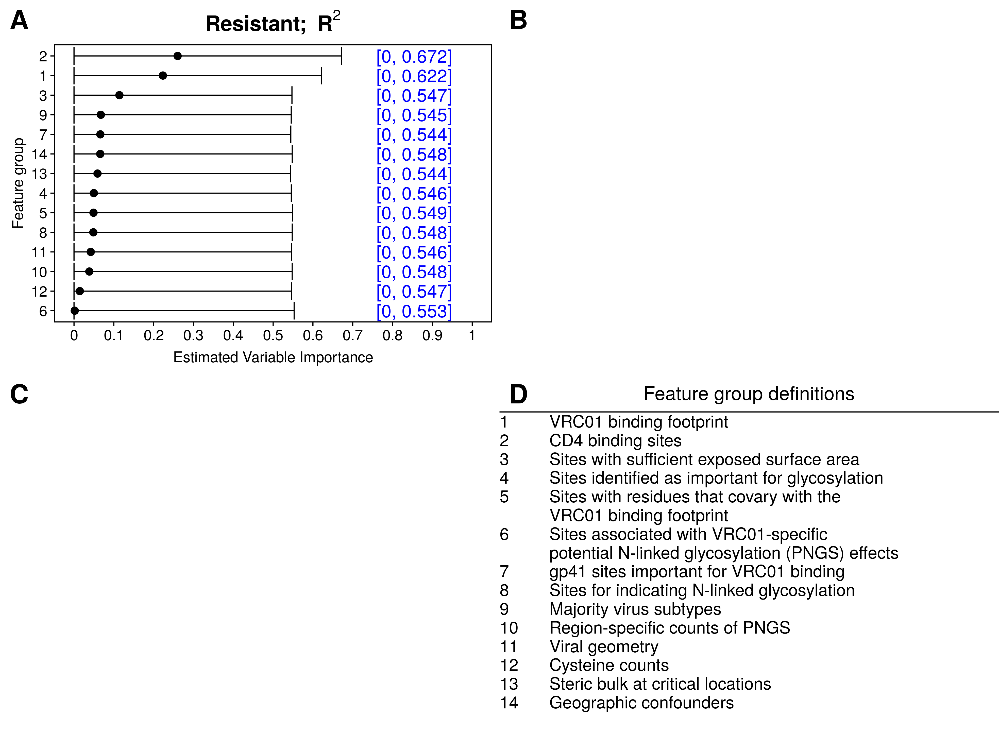

```{r xaringan-setup, include=FALSE, warning=FALSE}
library("xaringanthemer")

extra_css <- list(
  ".small" =  list(`font-size` = "80%"),
  ".large" =  list(`font-size` = "150%"),
  ".huge" =  list(`font-size` = "300%"),
  "ul li" = list(`margin-bottom` = "10px"),
  ".gray" = list(color = "#C0C0C0"),
  ".red" = list(color = "#FF0000"),
  ".green" = list(color = "#097969"),
  ".blue1" = list(color = "#3AABBE"),
  ".blue2" = list(color = "#2A6D90"),
  ".blue3" = list(color = "#446874"),
  ".purple" = list(color = "#624474"),
  ".mutedred" = list(color = "#745344"),
  "a" = list(color = "#3AABBE"),
  "a:hover" = list("text-decoration" = "underline")
)
# set up fonts
style_mono_accent(
  base_color = "#446874",
  header_font_google = google_font("DM Sans"),
  text_font_google   = google_font("DM Sans", "400", "400i"),
  code_font_google   = google_font("Courier Prime"),
  extra_css = extra_css
)

xaringanExtra::use_tile_view()
```

<style type="text/css">
.remark-slide-content {
    font-size: 20px
    header-h2-font-size: 1.75rem;
}
</style>

## Acknowledgments

This work was done in collaboration with:
```{r acknowledgments, echo = FALSE, fig.show = "hold", out.width = "65%", fig.align = "center"}
knitr::include_graphics(c(
    "img/people1.PNG"
  ))
```
```{r acknowledgments-2, echo = FALSE, fig.show = "hold", out.width = "50%", fig.align = "center"}
knitr::include_graphics(c(
    "img/people3.png"
  ))
```

---

## Variable importance: what and why

**What is variable importance?**

--

* .blue1[Quantification of "contributions" of a variable] (or a set of variables)

--

  Traditionally: contribution to .blue2[predictions]
--

* Useful to distinguish between contributions of predictions...
--

  * (.blue1[extrinsic importance]) ... .blue1[by a given (possibly black-box) algorithm]
  .small[ [e.g., Breiman, (2001)] ]
--

  * (.blue1[intrinsic importance]) ... .blue1[by best possible (i.e., oracle) algorithm]
  .small[ [e.g., van der Laan (2006)] ]
--

* Our work focuses on .blue1[interpretable, model-agnostic intrinsic importance]

--

Example uses of .blue2[intrinsic] variable importance:
* is it worth extracting text from notes in the EHR for the sake of predicting hospital readmission?

--

* is it worth collecting a given covariate for the sake of predicting neutralization sensitivity?


---

## Case study: ANOVA importance

Data unit $(X, Y) \sim P_0$ with:
* outcome $Y$ 
* covariate $X := (X_1, X_2, \ldots, X_p)$

--

**Goals:** 
* .green[estimate]
* .blue1[and do inference on]

the importance of $(X_j: j \in s)$ in predicting $Y$

--

How do we typically do this in **linear regression**?

---

## Case study: ANOVA importance

How do we typically do this in **linear regression**?

* Fit a linear regression of $Y$ on $X$ $\rightarrow \color{magenta}{\mu_n(X)}$
--

* Fit a linear regression of $Y$ on $X_{-s}$ $\rightarrow \color{magenta}{\mu_{n,-s}(X)}$
--

* .green[Compare the fitted values] $[\mu_n(X_i), \mu_{n,-s}(X_i)]$

--

Many ways to compare fitted values, including:
* ANOVA decomposition
* Difference in $R^2$

---

## Case study: ANOVA importance

Difference in $R^2$: $$\left[1 - \frac{n^{-1}\sum_{i=1}^n\{Y_i - \mu_n(X_i)\}^2}{n^{-1}\sum_{i=1}^n\{Y_i - \overline{Y}_n\}^2}\right] - \left[1 - \frac{n^{-1}\sum_{i=1}^n\{Y_i - \mu_{n,-s}(X_i)\}^2}{n^{-1}\sum_{i=1}^n\{Y_i - \overline{Y}_n\}^2}\right]$$

--

&zwj;Inference:
* Test difference
* Valid confidence interval

---

## Case study: ANOVA importance

Consider the .blue1[population parameter] $$\psi_{0,s} = \frac{E_0\{\mu_0(X) - \mu_{0,-s}(X)\}^2}{var_0(Y)}$$

* $\mu_0(x) := E_0(Y \mid X = x)$ .blue1[(true conditional mean)]
* $\mu_{0,-s}(x) := E_0(Y \mid X_{-s} = x_{-s})$ 

  [for a vector $z$, $z_{-s}$ represents $(z_j: j \notin s)$]

--

* .blue2[nonparametric extension] of linear regression-based ANOVA parameter

--

* Can be expressed as a $\color{magenta}{\text{difference in population } R^2}$ values, since $$\color{magenta}{\psi_{0,s} = \left[1 - \frac{E_0\{Y - \mu_0(X)\}^2}{var_0(Y)}\right] - \left[1 - \frac{E_0\{Y - \mu_{0,-s}(X)\}^2}{var_0(Y)}\right]}$$

---

## Case study: ANOVA importance

How should we make inference on $\psi_{0,s}$?
--

1. construct estimators $\mu_n$, $\mu_{n,-s}$ of $\mu_0$ and $\mu_{0,-s}$ (e.g., with machine learning)
--

2. plug in: $$\psi_{n,s} := \frac{\frac{1}{n}\sum_{i=1}^n \{\mu_n(X_i) - \mu_{n,-s}(X_i)\}^2}{\frac{1}{n}\sum_{i=1}^n (Y_i - \overline{Y}_n)^2}$$
--

  but this estimator has .red[asymptotic bias]
--

3. using influence function-based debiasing [e.g., Pfanzagl (1982)], we get estimator $$\color{magenta}{\psi_{n,s}^* := \left[1 - \frac{\frac{1}{n}\sum_{i=1}^n\{Y_i - \mu_n(X_i)\}^2}{\frac{1}{n}\sum_{i=1}^n (Y_i - \overline{Y}_n)^2}\right] - \left[1 - \frac{\frac{1}{n}\sum_{i=1}^n\{Y_i - \mu_{n,-s}(X_i)\}^2}{\frac{1}{n}\sum_{i=1}^n (Y_i - \overline{Y}_n)^2}\right]}$$

---

## Case study: ANOVA importance

$$\color{magenta}{\psi_{n,s}^* := \left[1 - \frac{\frac{1}{n}\sum_{i=1}^n\{Y_i - \mu_n(X_i)\}^2}{\frac{1}{n}\sum_{i=1}^n (Y_i - \overline{Y}_n)^2}\right] - \left[1 - \frac{\frac{1}{n}\sum_{i=1}^n\{Y_i - \mu_{n,-s}(X_i)\}^2}{\frac{1}{n}\sum_{i=1}^n (Y_i - \overline{Y}_n)^2}\right]}$$

Key observations:
* $\psi_{n,s}^* =$ plug-in estimator of $\psi_{0,s}$ based on difference-in- $R^2$ representation
--

* .blue1[No need to debias] the difference-in- $R^2$ estimator!
--

* Why does this happen? 

  .blue2[Estimation of] $\mu_{0}$ .blue2[and] $\mu_{0,-s}$ .blue2[yields only second-order terms, so estimator behaves as if they are **known**]
  
--

Under regularity conditions, $\psi_{n,s}^*$ is consistent and nonparametric efficient.

--

In particular, $\sqrt{n}(\psi_{n,s}^* - \psi_{0,s})$ has a mean-zero normal limit with estimable variance.

[Details in Williamson et al. (2020)]
---

## Preparing for AMP

```{r vrc01, echo = FALSE, out.width = "200px", fig.align = "center"}
knitr::include_graphics("img/amp.png")
```

* 611 HIV-1 pseudoviruses
* Outcome: neutralization sensitivity/resistance to antibody

--

**Goal:** pre-screen features for inclusion in secondary analysis
* 800 individual features, 13 groups of interest

--

&zwj;Procedure: 
1. Estimate $\mu_n$, $\mu_{n,-s}$ using Super Learner [van der Laan et al. (2007)]
2. Estimate and do inference on variable importance $\psi_{n,s}^*$ 

.small[ [Details in Magaret et al. (2019) and Williamson et al. (2021b)] ]

---

## Preparing for AMP: R-squared

```{r vrc01-r2, echo = FALSE, out.height="480px", fig.align="center"}

```

---

## Generalization to arbitrary measures

ANOVA example suggests a natural generalization:
--

* Choose a relevant measure of .blue1[predictiveness] for the task at hand

--

  * $V(f, P) =$ .blue1[predictiveness] of function $f$ under sampling from $P$
  * $\mathcal{F} =$ rich class of candidate prediction functions
  * $\mathcal{F}_{-s} =$ {all functions in $\mathcal{F}$ that ignore components with index in $s$} $\subset \mathcal{F}$
  
--

* Define the oracle prediction functions

  $f_0:=$ maximizer of $V(f, P_0)$ over $\mathcal{F}$ & $f_{0,-s}:=$ maximizer of $V(f, P_0)$ over $\mathcal{F}_{-s}$

--

Define the importance of $(X_j: j \in s)$ relative to $X$ as $$\color{magenta}{\psi_{0,s} := V(f_0, P_0) - V(f_{0,-s}, P_0) \geq 0}$$

---

## Generalization to arbitrary measures

Some examples of predictiveness measures:

(arbitrary outcomes)

&zwj; $R^2$: $V(f, P) = 1 - E_P\{Y - f(X)\}^2 / var_P(Y)$

--

(binary outcomes)

Classification accuracy: $V(f, P) = P\{Y = f(X)\}$

&zwj;AUC: $V(f, P) = P\{f(X_1) < f(X_2) \mid Y_1 = 0, Y_2 = 1\}$ for $(X_1, Y_1) \perp (X_2, Y_2)$

Pseudo- $R^2$ : $1 - \frac{E_P[Y \log f(X) - (1 - Y)\log \{1 - f(X)\}]}{P(Y = 1)\log P(Y = 1) + P(Y = 0)\log P(Y = 0)}$

---

## Generalization to arbitrary measures

How should we make inference on $\psi_{0,s}$?
--

1. construct estimators $f_n$, $f_{n,-s}$ of $f_0$ and $f_{0,-s}$ (e.g., with machine learning)
--

2. plug in: $$\psi_{n,s}^* := V(f_n, P_n) - V(f_{n,-s}, P_n)$$
  
  where $P_n$ is the empirical distribution based on the available data
--

3. Inference can be carried out using influence functions.
--
 Why?

We can write $V(f_n, P_n) - V(f_{0}, P_0) \approx \color{green}{V(f_0, P_n) - V(f_0, P_0)} + \color{blue}{V(f_n, P_0) - V(f_0, P_0)}$
--

* the $\color{green}{\text{green term}}$ can be studied using the functional delta method
* the $\color{blue}{\text{blue term}}$ is second-order because $f_0$ maximizes $V$ over $\mathcal{F}$

--

In other words: $f_0$ and $f_{0,-s}$ **can be treated as known** in studying behavior of $\psi_{n,s}^*$!

[Details in Williamson et al. (2021b)]

---

## Preparing for AMP: the full picture

```{r vrc01-r2-acc-auc, echo = FALSE, out.height="480px", fig.align="center"}
knitr::include_graphics("img/vim_ic50.censored_pres_r2_acc_auc_conditional_simple.png")
```

---

## Extension: longitudinal VIMs

So far: cross-sectional variable importance

Can we do inference on variable importance longitudinally?

```{r longitudinal-vim, echo = FALSE, out.width="480px", out.height = "360px", fig.align="center", message=FALSE, warning=FALSE}
library("dplyr")
library("ggplot2")
library("cowplot")
theme_set(theme_cowplot())
vims_1 <- tibble::tibble(s = "1", k = 1:5,
                         vim = c(1:5 * 0.1))
vims_2 <- tibble::tibble(s = "2", k = 1:5,
                         vim = rep(0.8, 5))
vims_3 <- tibble::tibble(s = "3", k = 1:5,
                         vim = c(2:0 * 0.1, rep(0, 2)))
all_vims <- tibble::as_tibble(rbind.data.frame(vims_1, vims_2, vims_3))
longitudinal_vim_plot <- all_vims %>%
  ggplot(aes(x = k, y = vim, shape = s)) +
  geom_point(size = 3) +
  geom_line(linetype = "dashed") +
  labs(x = "Time point", y = "True VIM", shape = "Feature of interest") +
  theme(legend.position = "bottom", legend.direction = "horizontal")
longitudinal_vim_plot
```

---

## Extension: longitudinal VIMs

```{r longitudinal-vim-2, echo = FALSE, out.width="360px", out.height = "240px", fig.align="center", message=FALSE}
longitudinal_vim_plot
```

.blue2[Yes!] And we can do inference on summaries of the time series:
* .blue1[average importance] over a contiguous subset of time points
* .green[linear trend] over a contiguous subset of time points
* .blue2[area under the trajectory] over a contiguous subset of time points

Inference relies on the functional delta method.

Manuscript with details forthcoming.

---

## Closing thoughts

.blue1[Population-based] variable importance:
* wide variety of meaningful measures
* simple estimators
* machine learning okay
* valid inference, testing
* extension to longitudinal VIMs
* extension to correlated features .small[ (Williamson and Feng, 2020) ]

Check out the software:

* [R package `vimp`](https://github.com/bdwilliamson/vimp)
* [Python package `vimpy`](https://github.com/bdwilliamson/vimpy)

`r icons::fontawesome('github')` https://github.com/bdwilliamson | `r icons::fontawesome('globe')` https://bdwilliamson.github.io

---

## References

* .small[ Breiman L. 2001. Random forests. _Machine Learning_.]
* .small[ Breiman L. 2001. Statistical modeling: the two cultures. _Statistical Science_.]
* .small[ Chernozhukov V et al. 2018. Double/debiased machine learning for treatment and structural parameters. _The Econometrics Journal_.]
* .small[ Magaret CA, Benkeser DC, Williamson BD, et al. 2019. Prediction of VRC01 neutralization sensitivity by HIV-1 gp160 sequence features. _PLoS Computational Biology_. ]
* .small[ van der Laan MJ. 2006. Statistical inference for variable importance. _The International Journal of Biostatistics_.]
* .small[ van der Laan MJ, Polley EC, and Hubbard AE. 2007. Super Learner. _Statistical Applications in Genetics and Molecular Biology_. ]
* .small[ van der Laan MJ and Rose S. 2011. Targeted learning: causal inference for observational and experimental data. _Springer_.]

---

## References

* .small[ Williamson BD, Magaret CA, Gilbert PB, Nizam S, Simmons C, and Benkeser DC. 2021a. Super LeArner Prediction of NAb Panels (SLAPNAP): a containerized tool for predicting combination monoclonal broadly neutralizing antibody sensitivity. _Bioinformatics_.]
* .small[ Williamson BD, Gilbert P, Carone M, and Simon N. 2020. Nonparametric variable importance assessment using machine learning techniques (+ rejoinder to discussion). _Biometrics_. ]
* .small[ Williamson BD, Gilbert P, Simon N, and Carone M. 2021b. A general framework for inference on algorithm-agnostic variable importance. _Journal of the American Statistical Association_. ]
* .small[ Williamson BD and Feng J. 2020. Efficient nonparametric statistical inference on population feature importance using Shapley values. _ICML_. ]

